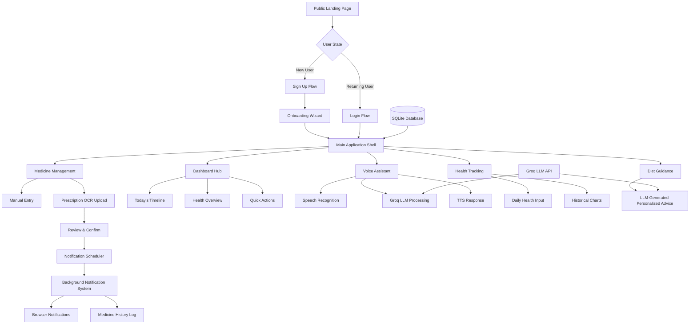
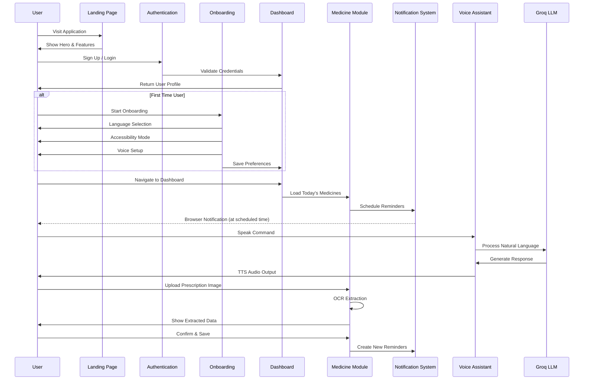
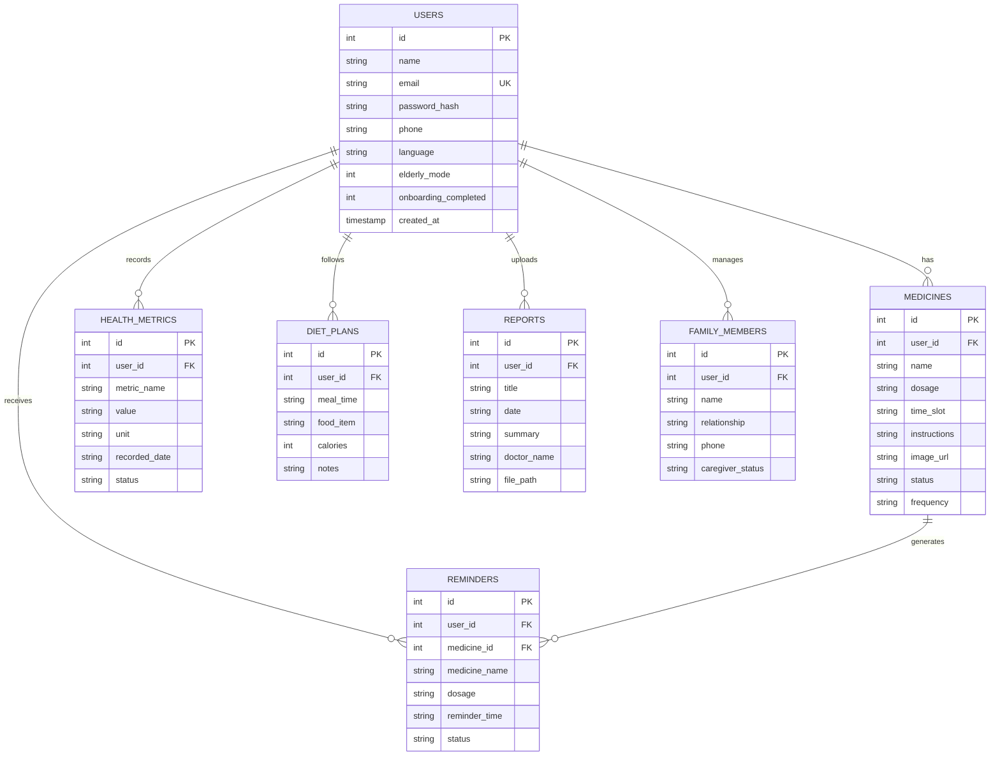

# Design Document: CareVoice Complete Redesign

## Overview

The CareVoice Complete Redesign transforms a collection of disconnected healthcare features into a cohesive, production-ready healthcare application with a **premium, professional UI that matches modern healthcare startup quality**. The redesign focuses on creating a real-world user journey from authentication through daily health management, incorporating real notification scheduling, prescription OCR extraction, voice assistant integration, and bilingual support (English/Telugu). The system maintains strict user data isolation, eliminates fake data patterns, and provides a mobile-first responsive interface optimized for elderly users. Built on Python/Streamlit with SQLite database, Groq LLM API, and comprehensive speech recognition capabilities.

**UI Design Philosophy**: The visual design follows the reference standard of clean, white-background healthcare applications with healthcare green (#166534) as the primary accent color. The interface prioritizes generous whitespace, professional typography, subtle shadows, and human-centered healthcare imagery to create a trustworthy, accessible experience that feels like a real healthcare product rather than a student project.

## UI Design System & Visual Identity

### Design Principles

Based on the reference healthcare application standard, CareVoice follows these core design principles:

1. **Premium Healthcare Aesthetic**: Clean, modern, trustworthy visual language that communicates professionalism
2. **Generous Whitespace**: Ample breathing room between elements for clarity and focus
3. **Human-Centered**: Real healthcare imagery showing diverse adults (especially elderly) using the product
4. **Product-First**: Show actual application interfaces rather than abstract concepts
5. **Accessibility-Driven**: Large touch targets, high contrast, readable typography
6. **Mobile-First**: Responsive layouts that work beautifully on all devices
7. **Subtle Sophistication**: Refined shadows, borders, and animations—never loud or flashy

### Color Palette

**Primary Colors**:
- **Background**: `#FFFFFF` (Pure White) / `#F8FAFB` (Off-white for sections)
- **Primary Green**: `#166534` (Healthcare Green) - used for CTAs, accents, logo
- **Dark Green**: `#14532D` (Hover states, focus)
- **Sage Green**: `#F0FDF4` (Light background sections)
- **Sage Border**: `#BBF7D0` (Subtle green borders)

**Text Colors**:
- **Primary Text**: `#0F172A` (Dark Charcoal)
- **Secondary Text**: `#475569` (Medium Gray)
- **Tertiary Text**: `#64748B` (Light Gray)

**UI Element Colors**:
- **Borders**: `#E2E8F0` (Very light gray-green)
- **Card Shadows**: `rgba(0, 0, 0, 0.02)` to `rgba(0, 0, 0, 0.08)` (Subtle)
- **Success**: `#DCFCE7` background with `#166534` text
- **Warning**: `#FEF3C7` background with `#92400E` text
- **Info**: `#DBEAFE` background with `#1E40AF` text

**Avoid**:
- Dark backgrounds (except for subtle overlays)
- Neon or bright saturated colors
- Excessive gradients
- Pure black text (too harsh)

### Typography

**Font Family**: 
- Primary: `'Inter', -apple-system, BlinkMacSystemFont, 'Segoe UI', sans-serif`
- Fallback: System fonts for performance

**Type Scale**:

**Headings**:
- **H1 (Hero)**: 48px / 700 weight / -0.02em letter-spacing / Line height 1.1
- **H2 (Section)**: 36px / 700 weight / -0.01em letter-spacing / Line height 1.2
- **H3 (Subsection)**: 28px / 600 weight / -0.01em letter-spacing / Line height 1.3
- **H4 (Card Title)**: 20px / 600 weight / Normal letter-spacing / Line height 1.4

**Body Text**:
- **Large Body**: 18px / 400 weight / Line height 1.6 (Hero descriptions)
- **Body**: 15px / 400 weight / Line height 1.6 (Standard)
- **Small**: 14px / 400 weight / Line height 1.5 (Captions, metadata)
- **Tiny**: 13px / 500 weight / Line height 1.4 (Labels, badges)

**Elderly Mode Adjustments**:
- Base font size increases from 15px to 20px
- All headings scale proportionally (+33%)
- Line height increases to 1.7 for body text
- Minimum touch target: 48px × 48px

### Spacing System

**Base Unit**: 4px

**Spacing Scale**:
- **xs**: 4px (Tight spacing, inline elements)
- **sm**: 8px (Form field padding, small gaps)
- **md**: 12px (Card padding, button padding)
- **lg**: 16px (Section padding, card margins)
- **xl**: 24px (Component separation)
- **2xl**: 32px (Major section separation)
- **3xl**: 48px (Hero padding)
- **4xl**: 64px (Page section padding)
- **5xl**: 96px (Large section padding)

**Container Widths**:
- **Full Width**: 100% (Mobile)
- **Container**: 1280px max-width (Desktop)
- **Narrow**: 720px max-width (Forms, content)
- **Wide**: 1440px max-width (Hero sections)

### Component Styling

**Buttons**:

Primary Button:
```css
background: #166534
color: #FFFFFF
padding: 12px 24px
border-radius: 10px
font-weight: 600
font-size: 15px
border: 1px solid #166534
transition: all 0.2s ease
box-shadow: 0 1px 2px rgba(0, 0, 0, 0.05)

hover:
  background: #14532D
  box-shadow: 0 4px 12px rgba(22, 101, 52, 0.15)
  transform: translateY(-1px)
```

Secondary Button:
```css
background: #F8FAFC
color: #0F172A
padding: 12px 24px
border-radius: 10px
font-weight: 600
font-size: 15px
border: 1px solid #E2E8F0
transition: all 0.2s ease

hover:
  background: #F1F5F9
  border-color: #CBD5E1
```

**Cards**:

Standard Card:
```css
background: #FFFFFF
border: 1px solid #E2E8F0
border-radius: 14px
padding: 24px
box-shadow: 0 2px 10px rgba(0, 0, 0, 0.02)
transition: box-shadow 0.2s ease

hover:
  box-shadow: 0 4px 20px rgba(0, 0, 0, 0.06)
```

Sage Card (Highlighted):
```css
background: #F0FDF4
border: 1px solid #BBF7D0
border-radius: 14px
padding: 24px
```

**Input Fields**:
```css
background: #FFFFFF
border: 1px solid #E2E8F0
border-radius: 8px
padding: 10px 14px
font-size: 15px
color: #0F172A
transition: all 0.2s ease

focus:
  border-color: #166534
  outline: 2px solid rgba(22, 101, 52, 0.1)
  outline-offset: 0
```

**Badges/Pills**:
```css
Status Taken:
  background: #DCFCE7
  color: #166534
  padding: 4px 14px
  border-radius: 20px
  font-size: 13px
  font-weight: 600

Status Pending:
  background: #FEF3C7
  color: #92400E
  padding: 4px 14px
  border-radius: 20px
  font-size: 13px
  font-weight: 600
```

### Icon System

**Icon Style**: Use professional, consistent icon library (e.g., Lucide, Heroicons, Feather)

**Icon Sizes**:
- **Small**: 16px (Inline with text)
- **Medium**: 20px (Buttons, nav)
- **Large**: 24px (Cards, features)
- **XLarge**: 32px (Hero sections)
- **XXLarge**: 48px (Empty states)

**Icon Colors**:
- Primary actions: `#166534` (Green)
- Secondary: `#64748B` (Gray)
- Active: `#14532D` (Dark green)

**Icon Usage**:
- **Navigation**: Home, Medicines, Health, Diet, Voice icons
- **Actions**: Add, Edit, Delete, Upload, Download
- **Status**: Check (taken), Clock (pending), X (skipped)
- **Features**: Pill, Microphone, Chart, Document, Users

**Avoid**: Emojis in production UI (only use professional icon sets)

### Imagery Guidelines

**Photography Style**:
- **Human-Centered**: Show real people (especially elderly adults 60+)
- **Authentic**: Natural lighting, genuine expressions, diverse representation
- **Healthcare Context**: People using smartphones/tablets for health management
- **Comfortable Settings**: Home environments, relaxed postures
- **Trust Signals**: Intergenerational care (elderly with adult children/caregivers)

**Product Screenshots**:
- **Realistic Mockups**: Show actual application interface in smartphone frames
- **High Quality**: Crisp, clear screenshots with readable text
- **Contextual**: Display relevant screens (medicine list, reminders, health tracking)
- **Floating UI Cards**: Subtle floating cards showing features (not overdone)

**Illustrations (If Used)**:
- **Professional Quality**: Clean, modern illustration style
- **Healthcare-Appropriate**: Avoid childish or cartoon aesthetics
- **Purposeful**: Use only when photo isn't available or appropriate
- **Consistent Style**: Match illustration style across all uses

**Avoid**:
- Stock photos with cheesy smiles or poses
- Generic tech/AI imagery unrelated to healthcare
- Childish illustrations or clip art
- Watermarked or low-quality images

### Animation & Interaction

**Transition Durations**:
- **Fast**: 150ms (Hover states, focus)
- **Normal**: 200ms (Button presses, toggles)
- **Slow**: 300ms (Page transitions, modals)

**Easing Functions**:
- **Standard**: `ease` (Most interactions)
- **Ease-out**: `cubic-bezier(0, 0, 0.2, 1)` (Entrances)
- **Ease-in**: `cubic-bezier(0.4, 0, 1, 1)` (Exits)

**Micro-interactions**:
- Button hover: Slight elevation + shadow increase + 1px upward translate
- Card hover: Shadow increase (subtle)
- Input focus: Border color change + outline glow
- Checkbox/Toggle: Smooth slide with color transition
- Loading states: Subtle pulse or spinner (not aggressive)

**Avoid**:
- Excessive animations
- Bouncing or spring effects (too playful)
- Long animation durations
- Distracting motion

### Responsive Breakpoints

```css
/* Mobile First Approach */
Base: 320px - 640px (Mobile)
sm: 640px+ (Large mobile)
md: 768px+ (Tablet)
lg: 1024px+ (Desktop)
xl: 1280px+ (Large desktop)
2xl: 1536px+ (Extra large)
```

**Layout Strategy**:
- **Mobile (< 768px)**: Single column, stacked cards, bottom navigation
- **Tablet (768px - 1024px)**: 2-column grids, collapsible sidebar
- **Desktop (1024px+)**: Multi-column layouts, permanent sidebar, wider containers

### Accessibility Standards

**WCAG 2.1 Level AA Compliance**:

**Color Contrast**:
- **Text on White**: Minimum 4.5:1 ratio (Body text uses `#0F172A` = 16.8:1 ✓)
- **Large Text**: Minimum 3:1 ratio
- **UI Components**: Minimum 3:1 ratio

**Interactive Elements**:
- **Touch Targets**: Minimum 44px × 44px (48px × 48px in Elderly Mode)
- **Focus Indicators**: Visible 2px outline with 2px offset
- **Keyboard Navigation**: All interactive elements accessible via Tab
- **Skip Links**: Skip to main content link for screen readers

**Screen Reader Support**:
- Semantic HTML (proper heading hierarchy)
- ARIA labels for icon-only buttons
- Alt text for all meaningful images
- Form labels properly associated

**Elderly Mode Enhancements**:
- 33% larger font sizes across the board
- Increased line height (1.7)
- Larger touch targets (minimum 48px)
- Higher contrast where needed
- Simplified navigation with fewer options visible at once

## Architecture



## Main Workflow Sequence



## Components and Interfaces

### Component 1: Authentication Module

**Purpose**: Manages user registration, login, session persistence, and multi-user account isolation

**Interface**:
```python
class AuthenticationModule:
    def register_user(name: str, email: str, password: str, phone: str = "", language: str = "en-IN") -> Tuple[Optional[Dict], Optional[str]]:
        """Create new user account with hashed password"""
        pass
    
    def authenticate_user(email: str, password: str) -> Tuple[Optional[Dict], Optional[str]]:
        """Validate credentials and return user profile"""
        pass
    
    def hash_password(password: str) -> str:
        """Generate SHA-256 hash with salt"""
        pass
    
    def update_user_preferences(user_id: int, language: Optional[str] = None, 
                               elderly_mode: Optional[bool] = None, 
                               onboarding_completed: Optional[bool] = None) -> Dict:
        """Update user settings and return updated profile"""
        pass
    
    def get_user_by_id(user_id: int) -> Optional[Dict]:
        """Retrieve user profile by ID"""
        pass
```

**Responsibilities**:
- Secure password hashing with salt
- Email uniqueness validation
- Session state management in Streamlit
- User preference persistence
- Multi-user data isolation enforcement

**Security Considerations**:
- SHA-256 hashing with fixed salt (upgrade to bcrypt/argon2 recommended)
- SQL injection prevention via parameterized queries
- Email normalization (lowercase, trim)
- No password strength validation (should be added)

### Component 2: Onboarding Wizard

**Purpose**: First-time user experience flow for language, accessibility, and voice preferences

**Interface**:
```python
class OnboardingWizard:
    def render_step_1_welcome() -> None:
        """Welcome screen with CareVoice introduction"""
        pass
    
    def render_step_2_language() -> str:
        """Language selection (English/Telugu)"""
        pass
    
    def render_step_3_accessibility() -> bool:
        """Elderly mode toggle for large fonts"""
        pass
    
    def render_step_4_voice_setup() -> str:
        """Voice gender selection for TTS"""
        pass
    
    def complete_onboarding(user_id: int, preferences: Dict) -> None:
        """Save preferences and mark onboarding as complete"""
        pass
```

**Responsibilities**:
- Progressive 4-step wizard interface
- Preference collection and validation
- Database persistence of user choices
- Smooth transition to main application

### Component 3: Dashboard Hub

**Purpose**: Central navigation and information hub showing today's health snapshot

**Interface**:
```python
class DashboardHub:
    def render_dashboard(user_id: int) -> None:
        """Main dashboard with all widgets"""
        pass
    
    def get_today_medicine_timeline(user_id: int) -> List[Dict]:
        """Retrieve today's scheduled medicines sorted by time"""
        pass
    
    def get_health_overview(user_id: int) -> Dict:
        """Latest health metrics (BP, sugar, weight)"""
        pass
    
    def render_quick_actions() -> None:
        """Action buttons for common tasks"""
        pass
    
    def render_upcoming_reminders(user_id: int) -> None:
        """Next 3 pending medicine reminders"""
        pass
```

**Responsibilities**:
- Today's medicine timeline visualization
- Real health data display (no fake data)
- Quick action navigation
- Upcoming reminder preview
- Voice assistant integration widget

**Data Display Rules**:
- Show ONLY database-stored values
- Display empty states for new users
- No placeholder or demo data generation
- Real-time refresh on data changes

### Component 4: Medicine Management Module

**Purpose**: Two-path medicine entry system with manual input and prescription OCR upload

**Interface**:
```python
class MedicineManagement:
    # Manual Entry Path
    def add_medicine_manual(user_id: int, name: str, dosage: str, 
                           time_slot: str, instructions: str, 
                           frequency: str = "Daily", 
                           image_url: Optional[str] = None) -> None:
        """Add medicine via manual form entry"""
        pass
    
    # Prescription OCR Path
    def upload_prescription_image(user_id: int, uploaded_file) -> str:
        """Save uploaded image and return file path"""
        pass
    
    def extract_prescription_ocr(image_path: str) -> Dict:
        """Use OCR to extract medicine data from prescription"""
        pass
    
    def review_extracted_medicines(extracted_data: Dict) -> List[Dict]:
        """Present extracted medicines for user review"""
        pass
    
    def confirm_and_save_medicines(user_id: int, medicines: List[Dict]) -> None:
        """Save confirmed medicines to database"""
        pass
    
    # Common Operations
    def get_all_medicines(user_id: int) -> List[Dict]:
        """Retrieve user's medicine list"""
        pass
    
    def update_medicine_status(user_id: int, medicine_id: int, status: str) -> None:
        """Update medicine status (Pending/Taken/Skipped)"""
        pass
    
    def delete_medicine(user_id: int, medicine_id: int) -> None:
        """Remove medicine from schedule"""
        pass
```

**Responsibilities**:
- Dual input method support (manual + OCR)
- Prescription image storage
- OCR extraction with review workflow
- Medicine CRUD operations
- Tablet image association (SVG data URIs)
- User-specific medicine isolation

**OCR Workflow**:
1. User uploads prescription image (JPG/PNG/PDF)
2. System extracts text using OCR library (Tesseract/cloud OCR)
3. LLM parses extracted text to structured medicine data
4. User reviews extracted medicines in editable table
5. User confirms or modifies entries
6. System saves to database and creates reminders

### Component 5: Notification Scheduler

**Purpose**: Real-time notification system for medicine reminders with action buttons

**Interface**:
```python
class NotificationScheduler:
    def schedule_medicine_reminders(user_id: int, medicine_id: int, 
                                   reminder_time: str) -> None:
        """Create scheduled reminder for specific medicine"""
        pass
    
    def check_due_reminders() -> List[Dict]:
        """Poll for reminders due in current minute"""
        pass
    
    def send_browser_notification(user_id: int, medicine: Dict) -> None:
        """Trigger browser notification with action buttons"""
        pass
    
    def handle_reminder_action(user_id: int, medicine_id: int, action: str) -> None:
        """Process user action: TAKE/SNOOZE/SKIP"""
        pass
    
    def log_medicine_history(user_id: int, medicine_id: int, action: str, timestamp: str) -> None:
        """Record medicine adherence history"""
        pass
    
    def get_active_reminders(user_id: int) -> List[Dict]:
        """Retrieve all active reminder schedules"""
        pass
```

**Responsibilities**:
- Time-based reminder scheduling
- Browser notification API integration
- Action button handling (Take/Snooze/Skip)
- Medicine adherence logging
- Snooze rescheduling (10-minute default)
- Historical adherence tracking

**Technical Challenges**:
- Streamlit lacks native background task support
- Browser notification permissions required
- State persistence across page refreshes
- Time zone handling

**Proposed Solutions**:
1. **JavaScript Integration**: Use Streamlit `components.v1.html()` to inject notification API calls
2. **Polling Mechanism**: Check due reminders on every app interaction
3. **External Scheduler**: Optional Python APScheduler for production deployment
4. **Local Storage**: Browser localStorage to persist reminder state

### Component 6: Voice Assistant Integration

**Purpose**: Bilingual natural language interface for hands-free interaction

**Interface**:
```python
class VoiceAssistant:
    def listen_to_speech(lang_code: str = "en-IN") -> str:
        """Capture audio input and convert to text"""
        pass
    
    def handle_intent(text: str, user_id: int, lang_code: str) -> Tuple[str, bool]:
        """Process user command and return response + navigation flag"""
        pass
    
    def get_ai_response(user_text: str, user_id: int, lang_code: str) -> str:
        """Generate contextual response using Groq LLM"""
        pass
    
    def build_system_prompt(lang_code: str, db_context: str) -> str:
        """Construct medical-safe system prompt with user data"""
        pass
    
    def speak_pyttsx3(text: str, voice_gender: str = "girl") -> None:
        """Text-to-speech using pyttsx3 engine"""
        pass
    
    def generate_audio_player(text: str, lang_code: str) -> str:
        """Generate gTTS audio and return HTML audio player"""
        pass
```

**Responsibilities**:
- Speech-to-text via Google Speech Recognition API
- Intent detection and command routing
- Context-aware LLM conversation
- Medical safety guardrails
- Bilingual support (English/Telugu)
- Text-to-speech output (pyttsx3 + gTTS)
- Navigation command execution

**Voice Commands Supported**:
- "Show my medicines" → Navigate to Medicines page
- "My blood pressure is 128/82" → Log health metric
- "Show today's reminders" → Display reminder list
- "Go to dashboard" → Navigate to Home
- "Open diet plan" → Navigate to Diet page
- General health questions → LLM conversational response

**Medical Safety Rules**:
1. Never diagnose medical conditions
2. Never suggest stopping medications
3. Advise consulting doctor for symptoms
4. Do not identify medicine images definitively
5. Provide informational guidance only

### Component 7: Health Tracking Module

**Purpose**: Daily health metrics input and historical visualization

**Interface**:
```python
class HealthTracking:
    def add_health_metric(user_id: int, metric_name: str, value: str, 
                         unit: str, status: str = "Normal") -> None:
        """Record health measurement"""
        pass
    
    def get_all_health_metrics(user_id: int) -> List[Dict]:
        """Retrieve all health records"""
        pass
    
    def get_metric_history(user_id: int, metric_name: str, days: int = 30) -> List[Dict]:
        """Get historical data for specific metric"""
        pass
    
    def render_health_charts(user_id: int, metric_name: str, period: str = "30") -> None:
        """Display line chart for metric trends (7/30/90 days)"""
        pass
    
    def calculate_metric_status(metric_name: str, value: str) -> str:
        """Determine if metric is Normal/High/Low based on thresholds"""
        pass
```

**Responsibilities**:
- Daily metric input forms (BP, blood sugar, weight, heart rate)
- Automatic date stamping
- Status calculation based on medical thresholds
- Historical chart visualization (7/30/90 day views)
- Dashboard integration for latest readings

**Supported Metrics**:
- Blood Pressure (systolic/diastolic in mmHg)
- Blood Sugar Fasting (mg/dL)
- Weight (kg)
- Heart Rate (bpm)

**Chart Features**:
- Line graphs with trend lines
- Color coding by status (green/yellow/red)
- Date range filtering
- Empty state for insufficient data

### Component 8: Personalized Diet Module

**Purpose**: LLM-generated dietary guidance using actual user health data

**Interface**:
```python
class PersonalizedDiet:
    def generate_diet_plan(user_id: int) -> str:
        """Generate personalized diet advice using LLM"""
        pass
    
    def get_user_health_context(user_id: int) -> Dict:
        """Aggregate user health data for LLM context"""
        pass
    
    def build_diet_prompt(health_context: Dict, lang_code: str) -> str:
        """Construct LLM prompt with medical disclaimers"""
        pass
    
    def render_diet_guidance(user_id: int) -> None:
        """Display diet plan with safety warnings"""
        pass
```

**Responsibilities**:
- Aggregate user medicines and health metrics
- Generate contextual LLM diet prompt
- Display personalized guidance with disclaimers
- Bilingual diet advice
- Safety warnings (not medical prescription)

**Safety Disclaimers**:
- "This is general guidance, not medical advice"
- "Consult your doctor before dietary changes"
- "Follow your prescribed diet plan from healthcare provider"

**LLM Context Includes**:
- Current medications and their purposes
- Latest health metrics (BP, sugar, weight)
- Medical conditions inferred from medicines
- Language preference

### Component 9: Navigation System

**Purpose**: Mobile-first bottom navigation with sidebar support

**Interface**:
```python
class NavigationSystem:
    def render_sidebar_nav(current_page: str) -> None:
        """Desktop sidebar navigation with icons"""
        pass
    
    def render_bottom_nav(current_page: str) -> None:
        """Mobile bottom navigation bar"""
        pass
    
    def navigate_to_page(page_name: str) -> None:
        """Update session state and trigger rerun"""
        pass
```

**Navigation Structure**:
- **Home** (🏠): Dashboard with today's overview
- **Medicines** (💊): Medicine schedule and status
- **Prescriptions** (📋): OCR upload workflow
- **Health** (🩺): Health metrics and charts
- **Diet** (🥗): Personalized diet guidance
- **Voice** (🎙️): Voice assistant interface
- **More**: Settings, family, reports

**Responsive Behavior**:
- Desktop: Sidebar always visible
- Mobile: Bottom navigation bar with 5 primary items
- Tablet: Collapsible sidebar option

## Data Models

### Model 1: User

```python
class User:
    id: int                          # Primary key
    name: str                        # Full name
    email: str                       # Unique email (normalized lowercase)
    password_hash: str               # SHA-256 hashed password
    phone: str                       # Optional phone number
    language: str                    # "en-IN" or "te-IN"
    elderly_mode: int                # 0 or 1 (boolean flag)
    onboarding_completed: int        # 0 or 1 (boolean flag)
    created_at: str                  # ISO timestamp
```

**Validation Rules**:
- Email must be unique and valid format
- Name cannot be empty
- Language must be valid locale code
- Password minimum 8 characters (not enforced yet)

### Model 2: Medicine

```python
class Medicine:
    id: int                          # Primary key
    user_id: int                     # Foreign key to users.id
    name: str                        # Medicine name
    dosage: str                      # e.g., "5 mg (1 Tablet)"
    time_slot: str                   # e.g., "Morning - 8:00 AM"
    instructions: str                # Usage instructions
    image_url: str                   # SVG data URI or image path
    status: str                      # "Pending" | "Taken" | "Skipped"
    frequency: str                   # "Daily" | "Weekly" | "As Needed"
```

**Validation Rules**:
- user_id must reference existing user
- name and dosage cannot be empty
- time_slot must contain valid time format
- status must be one of allowed values
- frequency defaults to "Daily"

### Model 3: HealthMetric

```python
class HealthMetric:
    id: int                          # Primary key
    user_id: int                     # Foreign key to users.id
    metric_name: str                 # "Blood Pressure" | "Blood Sugar" | "Weight" | "Heart Rate"
    value: str                       # Metric value (may be composite like "120/80")
    unit: str                        # "mmHg" | "mg/dL" | "kg" | "bpm"
    recorded_date: str               # ISO date string
    status: str                      # "Normal" | "High" | "Low" | "Optimal"
```

**Validation Rules**:
- user_id must reference existing user
- metric_name must be recognized type
- value must match metric format requirements
- recorded_date defaults to current date
- status calculated automatically based on thresholds

### Model 4: Reminder

```python
class Reminder:
    id: int                          # Primary key
    user_id: int                     # Foreign key to users.id
    medicine_id: int                 # Foreign key to medicines.id
    medicine_name: str               # Cached medicine name
    dosage: str                      # Cached dosage
    reminder_time: str               # "HH:MM AM/PM"
    status: str                      # "Active" | "Snoozed" | "Completed"
```

**Validation Rules**:
- user_id and medicine_id must reference existing records
- reminder_time must be valid time format
- Status workflow: Active → Taken/Snoozed/Skipped → Completed

### Model 5: DietPlan

```python
class DietPlan:
    id: int                          # Primary key
    user_id: int                     # Foreign key to users.id
    meal_time: str                   # "Breakfast" | "Lunch" | "Dinner" | "Snack"
    food_item: str                   # Description of food
    calories: int                    # Calorie count (optional)
    notes: str                       # Additional guidance
```

### Model 6: Report

```python
class Report:
    id: int                          # Primary key
    user_id: int                     # Foreign key to users.id
    title: str                       # Report title
    date: str                        # Report date (ISO format)
    summary: str                     # Plain-language summary
    doctor_name: str                 # Prescribing doctor
    file_path: str                   # Uploaded file path
```

### Model 7: FamilyMember

```python
class FamilyMember:
    id: int                          # Primary key
    user_id: int                     # Foreign key to users.id
    name: str                        # Contact name
    relationship: str                # "Daughter" | "Son" | "Spouse" | "Caregiver"
    phone: str                       # Contact phone number
    caregiver_status: str            # "Primary Caregiver" | "Emergency Contact"
```

## Database Schema



## Key Algorithms with Formal Specifications

### Algorithm 1: Medicine Reminder Scheduler

**Purpose**: Determines which reminders should trigger based on current time

```python
def check_due_reminders(current_time: str) -> List[Dict]:
    """
    Identifies medicine reminders that are due at the current time
    
    Preconditions:
    - current_time is valid HH:MM format (24-hour)
    - Database connection is active
    - Reminders table contains valid time_slot data
    
    Postconditions:
    - Returns list of reminder dictionaries
    - Each reminder has status "Active"
    - Reminder times match current_time within 1-minute window
    - No side effects on database
    
    Loop Invariants:
    - All processed reminders are within time window
    - User isolation maintained throughout iteration
    """
    pass
```

### Algorithm 2: OCR Prescription Extraction Pipeline

**Purpose**: Converts prescription image to structured medicine data

```python
def extract_prescription_ocr(image_path: str) -> Dict:
    """
    Multi-stage OCR and LLM parsing pipeline
    
    Preconditions:
    - image_path points to valid image file (JPG/PNG/PDF)
    - File size under 10MB
    - OCR library (Tesseract/cloud API) is available
    - Groq LLM client is initialized
    
    Postconditions:
    - Returns dictionary with keys: medicines, doctor_name, date, errors
    - medicines is list of dicts: {name, dosage, frequency, instructions}
    - If extraction fails, returns empty medicines list with error message
    - Original image file remains unmodified
    
    Algorithm Steps:
    1. Load and preprocess image (resize, grayscale, contrast)
    2. Apply OCR to extract raw text
    3. Send text to LLM with structured extraction prompt
    4. Parse LLM JSON response to medicine objects
    5. Validate extracted data completeness
    6. Return structured result
    
    Error Handling:
    - OCR failure → Return error dict
    - LLM timeout → Retry with fallback model
    - Invalid JSON → Manual parsing attempt
    """
    pass
```

### Algorithm 3: Voice Command Intent Routing

**Purpose**: Classifies user speech and routes to appropriate handler

```python
def handle_intent(text: str, user_id: int, lang_code: str) -> Tuple[str, bool]:
    """
    Natural language intent classification and action routing
    
    Preconditions:
    - text is non-empty string
    - user_id references valid user in database
    - lang_code is "en-IN" or "te-IN"
    
    Postconditions:
    - Returns tuple (response_text, is_navigation_command)
    - If navigation command detected, session_state.current_page is updated
    - Chat history is appended with interaction
    - No database modifications (read-only)
    
    Intent Categories:
    - Navigation: "show medicines", "go to dashboard", "open diet"
    - Health Input: "my blood pressure is X", "I weigh X kg"
    - Information: "what is my medicine", "when should I take X"
    - General: All other queries → LLM conversation
    
    Bilingual Support:
    - Telugu keywords: "మందులు" (medicines), "ఆహార" (diet)
    - Case-insensitive matching
    - Language-specific responses
    """
    pass
```

### Algorithm 4: Health Metric Status Calculator

**Purpose**: Determines if health metric is within normal range

```python
def calculate_metric_status(metric_name: str, value: str) -> str:
    """
    Threshold-based health metric classification
    
    Preconditions:
    - metric_name is one of: "Blood Pressure", "Blood Sugar (Fasting)", "Weight", "Heart Rate"
    - value is properly formatted for metric type
    
    Postconditions:
    - Returns status: "Optimal" | "Normal" | "High" | "Low" | "Critical"
    - Status determination is deterministic for same inputs
    
    Thresholds:
    Blood Pressure (systolic/diastolic):
      - Optimal: <120/<80
      - Normal: 120-139/80-89
      - High: 140-179/90-109
      - Critical: ≥180/≥110
    
    Blood Sugar (Fasting):
      - Low: <70 mg/dL
      - Optimal: 70-99 mg/dL
      - Normal: 100-125 mg/dL
      - High: ≥126 mg/dL
    
    Weight (BMI-based, requires height):
      - Based on BMI calculation if height available
    
    Heart Rate:
      - Low: <60 bpm
      - Normal: 60-100 bpm
      - High: >100 bpm
    """
    pass
```

## Algorithmic Pseudocode

### Main Authentication Flow

```python
ALGORITHM authenticateAndRoute(email, password)
INPUT: email (string), password (string)
OUTPUT: navigation_target (string: "app" | "onboarding" | "error")

BEGIN
  ASSERT email IS NOT empty AND password IS NOT empty
  
  # Step 1: Normalize email
  clean_email ← email.strip().toLowerCase()
  
  # Step 2: Hash password with salt
  password_hash ← SHA256(password + SALT_CONSTANT)
  
  # Step 3: Database lookup
  user_record ← database.query("SELECT * FROM users WHERE email = ?", clean_email)
  
  IF user_record IS NULL THEN
    RETURN "error", "No account found with this email"
  END IF
  
  # Step 4: Password verification
  IF user_record.password_hash ≠ password_hash THEN
    RETURN "error", "Incorrect password"
  END IF
  
  # Step 5: Session initialization
  session_state.user ← user_record
  session_state.lang_code ← user_record.language
  session_state.elderly_mode ← user_record.elderly_mode
  
  # Step 6: Route based on onboarding status
  IF user_record.onboarding_completed = 0 THEN
    RETURN "onboarding"
  ELSE
    RETURN "app"
  END IF
  
  ASSERT session_state.user IS NOT NULL
END
```

**Preconditions**:
- Database connection is established
- Users table exists and is populated
- SALT_CONSTANT is defined

**Postconditions**:
- If successful, session_state contains valid user object
- Navigation target returned indicates next view
- No password stored in session (only hash compared)

**Loop Invariants**: N/A (no loops)

### Prescription OCR Extraction Algorithm

```python
ALGORITHM extractPrescriptionData(image_path)
INPUT: image_path (string) - path to prescription image file
OUTPUT: extraction_result (dict) - structured medicine data

BEGIN
  ASSERT file_exists(image_path) AND file_size(image_path) < 10MB
  
  # Step 1: Load and preprocess image
  image ← load_image(image_path)
  image ← resize_image(image, max_width=1200)
  image ← convert_to_grayscale(image)
  image ← increase_contrast(image, factor=1.5)
  
  # Step 2: Apply OCR
  TRY
    raw_text ← tesseract_ocr(image, language="eng+tel")
  CATCH OCRError
    RETURN {medicines: [], error: "Failed to read image text"}
  END TRY
  
  ASSERT raw_text IS NOT empty
  
  # Step 3: LLM structured extraction
  extraction_prompt ← build_extraction_prompt(raw_text)
  
  TRY
    llm_response ← groq_llm.call(
      model="llama-3.3-70b-versatile",
      prompt=extraction_prompt,
      max_tokens=500,
      temperature=0.1
    )
  CATCH TimeoutError
    # Retry with fallback model
    llm_response ← groq_llm.call(
      model="openai/gpt-oss-120b",
      prompt=extraction_prompt
    )
  END TRY
  
  # Step 4: Parse JSON response
  TRY
    parsed_data ← JSON.parse(llm_response)
  CATCH JSONParseError
    # Attempt regex extraction as fallback
    parsed_data ← regex_medicine_extraction(raw_text)
  END TRY
  
  # Step 5: Validate extracted medicines
  validated_medicines ← []
  FOR each medicine IN parsed_data.medicines DO
    IF medicine.name IS NOT empty AND medicine.dosage IS NOT empty THEN
      validated_medicines.append(medicine)
    END IF
  END FOR
  
  # Step 6: Return structured result
  result ← {
    medicines: validated_medicines,
    doctor_name: parsed_data.doctor_name OR "Unknown",
    date: parsed_data.prescription_date OR current_date(),
    raw_text: raw_text,
    error: null
  }
  
  ASSERT result.medicines IS list
  RETURN result
END
```

**Preconditions**:
- image_path points to valid image file (JPG, PNG, or PDF)
- File size is under 10MB
- Tesseract OCR is installed and configured
- Groq LLM API client is initialized with valid API key

**Postconditions**:
- Returns dictionary with medicines list (may be empty)
- Each medicine has at minimum: name, dosage fields
- Original image file is not modified
- Error field is populated if extraction fails

**Error Handling**:
- OCR failure returns empty medicines list with error message
- LLM timeout triggers retry with fallback model
- JSON parse failure attempts regex-based extraction
- All errors are logged and returned in result dictionary

### Medicine Reminder Notification Algorithm

```python
ALGORITHM processMedicineReminders()
INPUT: none (uses current system time)
OUTPUT: notification_count (int) - number of notifications sent

BEGIN
  # Step 1: Get current time
  current_time ← get_current_time()  # Format: "HH:MM"
  current_hour ← current_time.hour
  current_minute ← current_time.minute
  
  # Step 2: Query due reminders
  due_reminders ← database.query("""
    SELECT r.*, u.language, m.image_url 
    FROM reminders r
    JOIN users u ON r.user_id = u.id
    JOIN medicines m ON r.medicine_id = m.id
    WHERE r.status = 'Active'
    AND r.reminder_time LIKE ?
  """, parameter=f"{current_hour:02d}:{current_minute:02d}%")
  
  notification_count ← 0
  
  # Step 3: Process each due reminder
  FOR each reminder IN due_reminders DO
    ASSERT reminder.user_id IS valid
    ASSERT reminder.medicine_id IS valid
    
    # Build notification payload
    notification ← {
      title: reminder.medicine_name,
      body: f"Time to take {reminder.dosage}",
      icon: reminder.image_url,
      actions: [
        {action: "take", title: "✓ Take"},
        {action: "snooze", title: "⏰ Snooze 10 min"},
        {action: "skip", title: "✗ Skip"}
      ],
      data: {
        user_id: reminder.user_id,
        medicine_id: reminder.medicine_id,
        reminder_id: reminder.id
      }
    }
    
    # Send browser notification
    send_browser_notification(notification)
    
    # Log notification sent
    database.execute("""
      INSERT INTO notification_log (user_id, medicine_id, sent_at, status)
      VALUES (?, ?, ?, 'Sent')
    """, reminder.user_id, reminder.medicine_id, current_time)
    
    notification_count ← notification_count + 1
  END FOR
  
  RETURN notification_count
END
```

**Preconditions**:
- Database connection is active
- reminders table contains scheduled reminders
- Browser notification API permissions granted by user
- System time is accurate

**Postconditions**:
- All due reminders have notifications sent
- notification_log table is updated with sent records
- Reminder status remains "Active" until user responds
- Returns count of notifications successfully sent

**Loop Invariants**:
- All processed reminders have current_time matching reminder_time
- User isolation maintained (no cross-user notifications)
- Each reminder generates exactly one notification

### Voice Intent Classification Algorithm

```python
ALGORITHM classifyVoiceIntent(text, user_id, lang_code)
INPUT: text (string) - transcribed speech, user_id (int), lang_code (string)
OUTPUT: (response_text (string), is_navigation (bool))

BEGIN
  ASSERT text IS NOT empty
  ASSERT user_id > 0
  ASSERT lang_code IN ["en-IN", "te-IN"]
  
  text_lower ← text.toLowerCase()
  is_telugu ← ("te" IN lang_code)
  
  # Intent Pattern Matching
  
  # Navigation Intent: Show Medicines
  IF any_keyword_match(text_lower, ["show my medicines", "my medicines", "view medicines", "మందులు"]) THEN
    session_state.current_page ← "Medicines"
    response ← "మీ ఈరోజు మందుల వివరాలను చూపిస్తున్నాను." IF is_telugu ELSE "Opening your medicines schedule."
    RETURN (response, true)
  END IF
  
  # Navigation Intent: Show Reports
  IF any_keyword_match(text_lower, ["show my reports", "view reports", "my reports", "రిపోర్టులు"]) THEN
    session_state.current_page ← "Reports"
    response ← "మీ మెడికల్ రిపోర్టులు చూపిస్తున్నాను." IF is_telugu ELSE "Opening your medical reports."
    RETURN (response, true)
  END IF
  
  # Navigation Intent: Diet Plan
  IF any_keyword_match(text_lower, ["open diet", "show diet", "diet plan", "ఆహార"]) THEN
    session_state.current_page ← "Diet"
    response ← "మీ ఆహార ప్లాన్ చూపిస్తున్నాను." IF is_telugu ELSE "Opening your diet guidance."
    RETURN (response, true)
  END IF
  
  # Navigation Intent: Dashboard
  IF any_keyword_match(text_lower, ["go to dashboard", "dashboard", "home", "డాష్‌బోర్డ్"]) THEN
    session_state.current_page ← "Home"
    response ← "డాష్‌బోర్డ్‌కి వెళ్తున్నాను." IF is_telugu ELSE "Navigating to Dashboard."
    RETURN (response, true)
  END IF
  
  # Health Input Intent: Blood Pressure
  IF regex_match(text_lower, "blood pressure is (\\d+)/(\\d+)") THEN
    systolic, diastolic ← extract_bp_values(text)
    add_health_metric(user_id, "Blood Pressure", f"{systolic}/{diastolic}", "mmHg")
    response ← f"రక్తపోటు {systolic}/{diastolic} నమోదు చేయబడింది." IF is_telugu ELSE f"Recorded blood pressure {systolic}/{diastolic}."
    RETURN (response, false)
  END IF
  
  # Default: LLM Conversational Response
  ai_response ← get_ai_response(text, user_id, lang_code)
  RETURN (ai_response, false)
END
```

**Preconditions**:
- text contains transcribed speech (may contain errors)
- user_id references existing user in database
- lang_code determines response language
- session_state is accessible for navigation

**Postconditions**:
- Returns response text appropriate for language
- If navigation intent, session_state.current_page is updated
- Health input intents persist data to database
- No modifications for general conversational queries

**Loop Invariants**: N/A (sequential conditional checks)

**Intent Priority**:
1. Navigation commands (highest priority - direct pattern match)
2. Health input commands (regex pattern extraction)
3. Conversational queries (fallback to LLM)

## Example Usage

### Example 1: New User Registration and Onboarding

```python
# User visits landing page
render_landing_page()

# User clicks "Get Started"
# → Navigates to Sign Up page

# User fills registration form
user_data = {
    "name": "Lakshmi Devi",
    "email": "lakshmi@example.com",
    "password": "SecurePass123",
    "phone": "+91 98765 43210",
    "language": "te-IN"
}

# System creates account
user, error = register_user(**user_data)
if error:
    display_error(error)
else:
    # Navigate to onboarding
    session_state.view = "onboarding"
    session_state.user = user

# Onboarding Step 1: Welcome
render_onboarding_step_1()

# Onboarding Step 2: Language confirmed (Telugu selected during signup)
render_onboarding_step_2()  # Shows selected: తెలుగు (te-IN)

# Onboarding Step 3: Elderly Mode
session_state.elderly_mode = True  # User enables large text mode

# Onboarding Step 4: Voice Setup
session_state.voice_gender = "girl"

# Complete onboarding
update_user_preferences(user["id"], onboarding_completed=True)
session_state.view = "app"

# User sees empty dashboard (no fake data)
render_dashboard()
# Shows: "ఈరోజు మందులు లేవు" (No medicines scheduled today)
# Shows: "ఆరోగ్య డేటా లేదు" (No health data available)
```

### Example 2: Adding Medicine via Prescription OCR

```python
# User navigates to Prescriptions page
session_state.current_page = "Prescriptions"

# Step 1: Upload prescription image
uploaded_file = st.file_uploader("Upload Prescription", type=["jpg", "png", "pdf"])

if uploaded_file:
    # Save uploaded file
    image_path = save_uploaded_file(uploaded_file, user_id)
    
    # Step 2: OCR Extraction
    st.spinner("Extracting medicine details from prescription...")
    extraction_result = extract_prescription_ocr(image_path)
    
    if extraction_result["error"]:
        st.error(f"Extraction failed: {extraction_result['error']}")
    else:
        # Step 3: Review extracted data
        st.write("### Review Extracted Medicines")
        
        # Display editable table
        extracted_medicines = extraction_result["medicines"]
        edited_medicines = st.data_editor(
            extracted_medicines,
            num_rows="dynamic",
            column_config={
                "name": st.column_config.TextColumn("Medicine Name", required=True),
                "dosage": st.column_config.TextColumn("Dosage", required=True),
                "time_slot": st.column_config.SelectboxColumn("Time", options=["Morning - 8:00 AM", "Afternoon - 1:00 PM", "Night - 9:00 PM"]),
                "instructions": st.column_config.TextColumn("Instructions"),
                "frequency": st.column_config.SelectboxColumn("Frequency", options=["Daily", "Weekly", "As Needed"])
            }
        )
        
        # Step 4: Confirm and save
        if st.button("✓ Confirm and Add Medicines"):
            for medicine in edited_medicines:
                add_medicine(
                    user_id=user_id,
                    name=medicine["name"],
                    dosage=medicine["dosage"],
                    time_slot=medicine["time_slot"],
                    instructions=medicine["instructions"],
                    frequency=medicine["frequency"]
                )
                
                # Create reminder
                schedule_medicine_reminders(user_id, medicine["id"], medicine["time_slot"])
            
            st.success(f"Added {len(edited_medicines)} medicines to your schedule!")
            session_state.current_page = "Medicines"
            st.rerun()
```

### Example 3: Voice Assistant Interaction

```python
# User clicks microphone button on dashboard
if st.button("🎙️ Talk to CareVoice", key="voice_btn"):
    # Capture speech
    user_speech = listen_to_speech(session_state.lang_code)
    
    if user_speech.startswith("ERROR_"):
        if user_speech == "ERROR_NOT_UNDERSTOOD":
            error_msg = "నాకు సరిగ్గా వినపడలేదు. దయచేసి మళ్ళీ మాట్లాడండి."
            st.warning(error_msg)
            play_audio(error_msg, session_state.lang_code)
    else:
        # Display user input
        st.chat_message("user").write(user_speech)
        
        # Process intent
        response, is_navigation = handle_intent(
            user_speech, 
            user_id, 
            session_state.lang_code
        )
        
        # Display response
        st.chat_message("assistant").write(response)
        
        # Play audio response
        play_audio(response, session_state.lang_code)
        
        # If navigation command, page will rerun to new page
        if is_navigation:
            st.rerun()

# Example voice commands and responses:

# Telugu navigation:
# User: "నా మందులు చూపించు" (Show my medicines)
# Response: "మీ ఈరోజు మందుల వివరాలను చూపిస్తున్నాను." + Navigate to Medicines page

# English health input:
# User: "My blood pressure is 128 over 82"
# Response: "Recorded blood pressure 128/82 mmHg. Your reading is in the normal range."

# Conversational query:
# User: "What medicine should I take for headache?"
# Response: "I see you're taking Amlodipine for blood pressure. For headache, please consult your doctor before taking any new medication. Over-the-counter pain relievers may interact with your current medicines."
```

### Example 4: Daily Health Tracking Workflow

```python
# User navigates to Health page
session_state.current_page = "Health"

# Display health input form
st.write("### Record Today's Health Metrics")

# Blood Pressure input
col1, col2 = st.columns(2)
with col1:
    systolic = st.number_input("Systolic (mmHg)", min_value=70, max_value=200, value=120)
with col2:
    diastolic = st.number_input("Diastolic (mmHg)", min_value=40, max_value=130, value=80)

# Blood Sugar input
blood_sugar = st.number_input("Blood Sugar (Fasting, mg/dL)", min_value=50, max_value=400, value=95)

# Weight input
weight = st.number_input("Weight (kg)", min_value=30.0, max_value=200.0, value=68.5, step=0.1)

# Heart Rate input
heart_rate = st.number_input("Heart Rate (bpm)", min_value=40, max_value=200, value=72)

# Submit button
if st.button("💾 Save Today's Metrics"):
    # Calculate statuses
    bp_status = calculate_metric_status("Blood Pressure", f"{systolic}/{diastolic}")
    sugar_status = calculate_metric_status("Blood Sugar (Fasting)", str(blood_sugar))
    
    # Save to database
    add_health_metric(user_id, "Blood Pressure", f"{systolic}/{diastolic}", "mmHg", bp_status)
    add_health_metric(user_id, "Blood Sugar (Fasting)", str(blood_sugar), "mg/dL", sugar_status)
    add_health_metric(user_id, "Weight", str(weight), "kg", "Healthy")
    add_health_metric(user_id, "Heart Rate", str(heart_rate), "bpm", "Normal")
    
    st.success("✓ Health metrics recorded successfully!")

# Display historical charts
st.write("### Blood Pressure Trend")
period = st.selectbox("Time Period", ["7 Days", "30 Days", "90 Days"])
render_health_charts(user_id, "Blood Pressure", period)

# Chart shows:
# - Line graph with dates on X-axis
# - Systolic and diastolic as separate lines
# - Color zones: green (optimal), yellow (normal), red (high)
# - Data points with tooltips
```

### Example 5: Real-time Medicine Reminder Flow

```python
# Background process (runs every minute)
def background_reminder_checker():
    while True:
        # Check for due reminders
        notification_count = processMedicineReminders()
        
        if notification_count > 0:
            print(f"Sent {notification_count} medicine reminders")
        
        # Wait 60 seconds
        time.sleep(60)

# Browser notification handler (JavaScript injected via Streamlit)
notification_js = """
<script>
// Request notification permission on page load
if (Notification.permission === "default") {
    Notification.requestPermission();
}

// Function to show medicine reminder
function showMedicineReminder(data) {
    if (Notification.permission === "granted") {
        const notification = new Notification(data.title, {
            body: data.body,
            icon: data.icon,
            tag: `medicine-${data.medicine_id}`,
            requireInteraction: true,
            actions: [
                {action: "take", title: "✓ Take"},
                {action: "snooze", title: "⏰ Snooze 10 min"},
                {action: "skip", title: "✗ Skip"}
            ]
        });
        
        notification.onclick = function(event) {
            const action = event.action;
            
            // Send action to backend
            fetch('/medicine_action', {
                method: 'POST',
                headers: {'Content-Type': 'application/json'},
                body: JSON.stringify({
                    user_id: data.user_id,
                    medicine_id: data.medicine_id,
                    action: action
                })
            });
            
            notification.close();
        };
    }
}

// Poll for reminders every minute
setInterval(function() {
    fetch('/check_reminders')
        .then(response => response.json())
        .then(reminders => {
            reminders.forEach(reminder => showMedicineReminder(reminder));
        });
}, 60000);
</script>
"""

st.components.v1.html(notification_js, height=0)

# User receives notification at 8:00 AM for Amlodipine
# User clicks "✓ Take"
# System logs action and updates medicine status

def handle_medicine_action(user_id, medicine_id, action):
    timestamp = datetime.now().isoformat()
    
    if action == "take":
        # Update medicine status
        update_medicine_status(user_id, medicine_id, "Taken")
        
        # Log adherence
        log_medicine_history(user_id, medicine_id, "Taken", timestamp)
        
        # Mark reminder as completed
        database.execute("""
            UPDATE reminders 
            SET status = 'Completed' 
            WHERE user_id = ? AND medicine_id = ? AND DATE(reminder_time) = DATE('now')
        """, user_id, medicine_id)
        
    elif action == "snooze":
        # Reschedule for 10 minutes later
        new_time = (datetime.now() + timedelta(minutes=10)).strftime("%I:%M %p")
        update_reminder_time(user_id, medicine_id, new_time)
        
    elif action == "skip":
        # Mark as skipped
        update_medicine_status(user_id, medicine_id, "Skipped")
        log_medicine_history(user_id, medicine_id, "Skipped", timestamp)
```

## Correctness Properties

### Property 1: User Data Isolation
**Universal Quantification**: ∀ user_id₁, user_id₂ ∈ Users, user_id₁ ≠ user_id₂ ⟹ data(user_id₁) ∩ data(user_id₂) = ∅

**Verification**: All database queries include `WHERE user_id = ?` clause with parameterized user_id. No cross-user data access is possible without explicit user_id parameter.

**Test Strategy**: 
- Create two test users with different medicines
- Query medicines for user1 and verify user2's medicines are not returned
- Attempt to update user2's medicine with user1's credentials and verify failure

### Property 2: Password Security
**Universal Quantification**: ∀ password ∈ Passwords, stored_password = SHA256(password + SALT)

**Verification**: No plaintext passwords stored in database. All password comparisons use hashed values.

**Test Strategy**:
- Register user with password "TestPass123"
- Query database directly and verify stored value is 64-character hex string
- Verify same password produces same hash (deterministic)
- Verify different passwords produce different hashes (collision resistance)

### Property 3: Medicine Reminder Timing Accuracy
**Universal Quantification**: ∀ reminder ∈ ActiveReminders, |notification_time - scheduled_time| ≤ 1 minute

**Verification**: Reminder polling runs every 60 seconds and matches current time within 1-minute window.

**Test Strategy**:
- Schedule reminder for specific time (e.g., 14:30)
- Mock system time to 14:29, 14:30, 14:31
- Verify notification sent only at 14:30 ±1 minute

### Property 4: No Fake Data Generation
**Universal Quantification**: ∀ displayed_data ∈ UI, ∃ database_record such that displayed_data = database_record

**Verification**: All UI components query database for display values. No hardcoded placeholder data.

**Test Strategy**:
- Create new user account
- Verify dashboard shows "No medicines scheduled" instead of sample medicines
- Verify health page shows "No data available" instead of fake metrics
- Query database and confirm zero records for new user

### Property 5: OCR Extraction Completeness
**Universal Quantification**: ∀ prescription_image ∈ ValidImages, extracted_medicines.count ≥ 0 ∧ (extracted_medicines.count = 0 ⟹ error_message ≠ null)

**Verification**: OCR pipeline always returns dictionary with medicines list (may be empty) and error field.

**Test Strategy**:
- Test with valid prescription image: verify medicines extracted
- Test with blank image: verify empty list with error message
- Test with corrupted file: verify error handling without crash

### Property 6: Bilingual Consistency
**Universal Quantification**: ∀ user ∈ Users, user.language = "te-IN" ⟹ all_responses_in_telugu(user)

**Verification**: All user-facing messages check `session_state.lang_code` and return appropriate language string.

**Test Strategy**:
- Set user language to Telugu
- Trigger various voice commands and verify responses in Telugu
- Check UI labels and verify Telugu text displayed
- Verify LLM system prompt includes Telugu language instruction

### Property 7: Medicine Status Workflow
**Universal Quantification**: ∀ medicine ∈ Medicines, status_transition(medicine) ⊆ {(Pending→Taken), (Pending→Skipped), (Taken→Pending), (Skipped→Pending)}

**Verification**: Status updates follow valid state machine transitions.

**Test Strategy**:
- Create medicine with status "Pending"
- Transition to "Taken" and verify database update
- Attempt invalid transition "Taken" → "Skipped" directly (should require reset to Pending first)

## Error Handling

### Error Scenario 1: OCR Extraction Failure

**Condition**: Prescription image is illegible, corrupted, or contains no text

**Response**: 
- Return extraction_result with empty medicines list
- Populate error field: "Failed to extract medicine details. Please try a clearer image or enter medicines manually."
- Display error message in UI with option to retry or switch to manual entry

**Recovery**: 
- User can re-upload different image
- User can switch to manual medicine entry form
- No database changes persist from failed extraction

### Error Scenario 2: Speech Recognition Timeout

**Condition**: No speech detected within 8-second phrase timeout or ambient noise too high

**Response**:
- Return error code: "ERROR_NOT_UNDERSTOOD"
- Display warning: "I couldn't hear clearly. Please try speaking again."
- Play audio error message in user's language

**Recovery**:
- User can retry voice input immediately
- System adjusts for ambient noise on next attempt
- Fallback to text input if voice repeatedly fails

### Error Scenario 3: LLM API Unavailable

**Condition**: Groq API returns timeout, rate limit, or authentication error

**Response**:
- Try fallback models in sequence: llama-3.3 → gpt-oss-120b → gpt-oss-20b
- If all models fail, return generic response: "I apologize, I experienced a technical issue connecting to the AI service."
- Log error for monitoring

**Recovery**:
- User can retry request after brief delay
- Voice assistant reverts to rule-based intent matching (no LLM required for navigation commands)
- Critical features (medicine management, health tracking) continue to function without LLM

### Error Scenario 4: Browser Notification Permission Denied

**Condition**: User denies notification permission or browser doesn't support Notification API

**Response**:
- Display banner: "Medicine reminders require notification permission. Please enable in your browser settings."
- Provide instructions for enabling notifications per browser type
- Fallback to in-app reminder list on dashboard

**Recovery**:
- User can grant permission later and reminders will activate
- In-app reminders visible when user visits dashboard
- Voice assistant can announce upcoming reminders verbally

### Error Scenario 5: Invalid Health Metric Input

**Condition**: User enters blood pressure as "120" instead of "120/80" or negative weight value

**Response**:
- Form validation error: "Please enter blood pressure in format: systolic/diastolic (e.g., 120/80)"
- Prevent form submission until corrected
- Highlight invalid field in red

**Recovery**:
- User corrects input format
- Provide example values as placeholder text
- Voice input includes format parsing (handles "128 over 82" → "128/82")

### Error Scenario 6: Database Connection Failure

**Condition**: SQLite database file locked, corrupted, or inaccessible

**Response**:
- Display critical error page: "Unable to access health data. Please contact support."
- Log detailed error for debugging
- Prevent application from rendering incomplete/incorrect data

**Recovery**:
- Check file permissions and repair database if corrupted
- Implement database connection pooling to prevent locks
- Regular automated backups for restoration

## Testing Strategy

### Unit Testing Approach

**Coverage Goals**: 80% code coverage for core modules

**Key Test Suites**:

1. **Authentication Tests** (`test_authentication.py`)
   - Password hashing consistency
   - Duplicate email rejection
   - Login failure scenarios
   - Session state initialization

2. **Medicine Management Tests** (`test_medicines.py`)
   - Manual medicine addition
   - OCR extraction parsing
   - Status update workflows
   - User isolation verification

3. **Health Tracking Tests** (`test_health.py`)
   - Metric value validation
   - Status calculation accuracy
   - Historical data retrieval
   - Chart data formatting

4. **Voice Assistant Tests** (`test_voice.py`)
   - Intent classification accuracy
   - Bilingual response generation
   - Command routing correctness
   - LLM fallback handling

**Testing Libraries**:
- `pytest` for test execution
- `pytest-mock` for mocking external APIs
- `sqlite3` in-memory database for isolated tests

**Example Unit Test**:
```python
def test_calculate_bp_status_optimal():
    status = calculate_metric_status("Blood Pressure", "118/78")
    assert status == "Optimal"

def test_calculate_bp_status_high():
    status = calculate_metric_status("Blood Pressure", "145/95")
    assert status == "High"

def test_user_isolation():
    user1_id = create_test_user("user1@test.com")
    user2_id = create_test_user("user2@test.com")
    
    add_medicine(user1_id, "Medicine A", "10mg", "Morning - 8:00 AM", "Test")
    
    user2_medicines = get_all_medicines(user2_id)
    assert len(user2_medicines) == 0  # User2 should not see User1's medicine
```

### Property-Based Testing Approach

**Property Test Library**: hypothesis (Python)

**Key Properties to Test**:

1. **Password Hashing Determinism**
   - Property: Same password always produces same hash
   - Generator: Random ASCII strings 8-50 characters
   - Assertion: `hash_password(pwd) == hash_password(pwd)`

2. **Medicine Time Slot Parsing**
   - Property: All valid time formats parse to HH:MM
   - Generator: Time strings in formats "8:00 AM", "08:00", "8 AM"
   - Assertion: Extracted time is valid 24-hour format

3. **Health Metric Status Calculation**
   - Property: Status calculation is idempotent
   - Generator: Random BP values 70-200 / 40-130
   - Assertion: `calculate_status(bp) == calculate_status(calculate_status(bp))`

4. **User Data Isolation**
   - Property: No cross-user data leakage
   - Generator: Pairs of distinct user IDs
   - Assertion: `get_user_data(uid1) ∩ get_user_data(uid2) = ∅`

**Example Property Test**:
```python
from hypothesis import given, strategies as st

@given(st.text(min_size=8, max_size=50))
def test_password_hash_determinism(password):
    hash1 = hash_password(password)
    hash2 = hash_password(password)
    assert hash1 == hash2
    assert len(hash1) == 64  # SHA-256 produces 64-character hex

@given(st.integers(min_value=70, max_value=200), 
       st.integers(min_value=40, max_value=130))
def test_bp_status_always_valid(systolic, diastolic):
    status = calculate_metric_status("Blood Pressure", f"{systolic}/{diastolic}")
    assert status in ["Optimal", "Normal", "High", "Critical"]
```

### Integration Testing Approach

**Integration Test Scenarios**:

1. **End-to-End User Registration Flow**
   - Sign up → Onboarding → Dashboard → Medicine addition → Reminder creation
   - Verify database contains all expected records
   - Verify session state correct at each step

2. **Prescription OCR Pipeline**
   - Upload image → OCR extraction → LLM parsing → Review → Confirmation → Database save
   - Mock OCR and LLM responses
   - Verify medicines saved with correct user_id

3. **Voice Command to Action**
   - Speech input → Transcription → Intent classification → Navigation → Page render
   - Mock speech recognition
   - Verify correct page displayed

4. **Medicine Reminder Lifecycle**
   - Medicine creation → Reminder scheduling → Notification trigger → User action → Status update → History log
   - Mock time progression
   - Verify complete audit trail

**Integration Test Tools**:
- `pytest-bdd` for behavior-driven development
- Streamlit testing library for UI component testing
- Mock external APIs (Groq, Google Speech API)

**Example Integration Test**:
```python
def test_prescription_ocr_to_reminder_flow():
    # Setup
    user_id = create_test_user("integration@test.com")
    prescription_image = "test_prescription.jpg"
    
    # Mock OCR extraction
    mock_ocr_result = {
        "medicines": [
            {"name": "Metformin", "dosage": "500mg", "time_slot": "08:00", "instructions": "With food"}
        ],
        "error": None
    }
    
    with patch('extract_prescription_ocr', return_value=mock_ocr_result):
        # Execute OCR workflow
        result = upload_and_extract_prescription(user_id, prescription_image)
        
        # Confirm medicines
        confirm_and_save_medicines(user_id, result["medicines"])
    
    # Verify medicine saved
    medicines = get_all_medicines(user_id)
    assert len(medicines) == 1
    assert medicines[0]["name"] == "Metformin"
    
    # Verify reminder created
    reminders = get_active_reminders(user_id)
    assert len(reminders) == 1
    assert reminders[0]["reminder_time"] == "08:00 AM"
```

## Performance Considerations

### Database Query Optimization

**Challenge**: SQLite performance degradation with large datasets

**Strategies**:
- Index user_id columns on all user-scoped tables
- Compound index on (user_id, recorded_date) for health_metrics
- Limit query results to recent data (last 90 days) with pagination
- Use `EXPLAIN QUERY PLAN` to analyze slow queries

**Example Index Creation**:
```sql
CREATE INDEX idx_medicines_user_id ON medicines(user_id);
CREATE INDEX idx_health_metrics_user_date ON health_metrics(user_id, recorded_date);
CREATE INDEX idx_reminders_user_status ON reminders(user_id, status);
```

### Streamlit Performance

**Challenge**: Streamlit reruns entire script on every interaction

**Strategies**:
- Use `@st.cache_data` for database queries
- Use `@st.cache_resource` for API clients (Groq, TTS engine)
- Implement session state for navigation to avoid re-queries
- Lazy load heavy components (charts only render when page active)

**Example Caching**:
```python
@st.cache_data(ttl=60)  # Cache for 60 seconds
def get_user_medicines(user_id):
    return db.get_all_medicines(user_id)

@st.cache_resource
def get_groq_client():
    return Groq(api_key=GROQ_API_KEY)
```

### Voice Processing Latency

**Challenge**: Speech recognition and TTS introduce 2-5 second delays

**Strategies**:
- Display "Listening..." indicator immediately on button press
- Show transcription text while waiting for LLM response
- Preload TTS engine on page load
- Use gTTS for better quality at cost of slight delay
- Fallback to pyttsx3 for instant (but lower quality) output

### Notification Polling Overhead

**Challenge**: Checking reminders every minute adds database load

**Strategies**:
- Query only reminders with time matching current hour (reduce query size)
- Use database triggers to mark reminders as "due" in advance
- Consider external scheduler (APScheduler) for production
- Batch process multiple due reminders in single query

## Security Considerations

### Password Storage

**Current Implementation**: SHA-256 with fixed salt

**Security Issues**:
- Fixed salt vulnerable to rainbow tables if database compromised
- SHA-256 is fast (attacker can brute force)

**Recommendations**:
- Migrate to bcrypt or Argon2id with per-user salts
- Implement password strength requirements (minimum 12 characters, complexity)
- Add rate limiting on login attempts
- Implement account lockout after 5 failed attempts

### SQL Injection Prevention

**Current Implementation**: Parameterized queries throughout

**Verification**:
- All database queries use `?` placeholders
- User input never concatenated into SQL strings
- Example: `cursor.execute("SELECT * FROM users WHERE email = ?", (email,))`

**Continued Best Practices**:
- Code review all new database queries
- Use ORM (SQLAlchemy) for complex queries
- Enable SQLite security features (disable `LOAD_EXTENSION`)

### Session Management

**Current Implementation**: Streamlit session state (in-memory)

**Security Issues**:
- Session persists in browser memory only (resets on refresh)
- No session timeout mechanism
- No CSRF protection

**Recommendations**:
- Implement server-side session storage (Redis/database)
- Add session timeout (30 minutes inactivity)
- Generate CSRF tokens for state-changing operations
- Use HTTPS in production

### API Key Security

**Current Implementation**: Groq API key hardcoded in code

**Security Issues**:
- API key visible in source code
- No key rotation mechanism
- Exposed in client-side JavaScript

**Recommendations**:
- Store API keys in environment variables only
- Use secrets management service (AWS Secrets Manager, HashiCorp Vault)
- Implement API key rotation schedule
- Add rate limiting per user to prevent abuse

### Input Validation

**Current Status**: Limited validation on forms

**Required Validations**:
- Email format validation (regex)
- Phone number format validation
- Medicine dosage format validation (prevent script injection)
- Health metric range validation (prevent nonsensical values)
- File upload type and size restrictions (max 10MB, only JPG/PNG/PDF)

### Medical Data Privacy (HIPAA Considerations)

**Current Implementation**: Single-user local application

**Privacy Requirements for Production**:
- Encrypt database at rest (SQLCipher)
- Encrypt sensitive fields (prescriptions, health metrics)
- Implement audit logging for data access
- Add data export functionality (user data portability)
- Implement data retention policies and deletion
- Add terms of service and privacy policy

## Dependencies

### Core Dependencies

**Python Version**: 3.11+

**Application Framework**:
- `streamlit` (^1.28.0): Web UI framework

**Database**:
- `sqlite3` (built-in): Local database storage

**LLM Integration**:
- `groq` (^0.4.0): Groq LLM API client
- API Models: llama-3.3-70b-versatile, openai/gpt-oss-120b, openai/gpt-oss-20b

**Voice Processing**:
- `SpeechRecognition` (^3.10.0): Speech-to-text via Google Speech API
- `pyttsx3` (^2.90): Offline text-to-speech engine
- `gTTS` (^2.4.0): Google Text-to-Speech for high-quality audio
- `pyaudio` (^0.2.14): Audio input/output handling

**Utilities**:
- `python-dotenv` (^1.0.0): Environment variable management

### Optional Production Dependencies

**OCR (Not Yet Implemented)**:
- `pytesseract` (^0.3.10): Tesseract OCR wrapper
- `Pillow` (^10.1.0): Image preprocessing
- Alternative: Google Cloud Vision API, AWS Textract

**Notification Scheduling**:
- `APScheduler` (^3.10.4): Background task scheduler
- Alternative: Celery with Redis broker

**Enhanced Security**:
- `bcrypt` (^4.1.1): Secure password hashing
- `cryptography` (^41.0.7): Database encryption (SQLCipher)

**Database ORM**:
- `SQLAlchemy` (^2.0.23): Type-safe database queries

**Testing**:
- `pytest` (^7.4.3): Test framework
- `pytest-mock` (^3.12.0): Mocking library
- `hypothesis` (^6.92.1): Property-based testing
- `pytest-bdd` (^6.1.1): Behavior-driven development

**Monitoring**:
- `sentry-sdk` (^1.38.0): Error tracking
- `prometheus-client` (^0.19.0): Metrics collection

### External Services

**Groq LLM API**:
- Base URL: https://api.groq.com/openai/v1
- Authentication: API key in `Authorization: Bearer` header
- Rate Limits: 30 requests/minute (free tier)

**Google Speech Recognition API**:
- Accessed via SpeechRecognition library
- No API key required (uses Google's free tier)
- Rate limits apply (50 requests/day typical)

**Browser Notification API**:
- Native browser API (no external service)
- Requires HTTPS in production
- User permission required

### System Requirements

**Operating Systems**:
- Windows 10/11
- macOS 12+
- Linux (Ubuntu 20.04+)

**Hardware Requirements**:
- Minimum 4GB RAM
- 500MB disk space
- Microphone for voice input
- Speakers/headphones for audio output

**Browser Requirements** (for Streamlit app):
- Chrome 90+
- Firefox 88+
- Safari 15+
- Edge 90+

---

## Implementation Roadmap

### Phase 1: Foundation (Weeks 1-2)
- ✅ Multi-user authentication system
- ✅ User isolation enforcement
- ✅ Onboarding wizard
- ✅ Session management

### Phase 2: Core Features (Weeks 3-4)
- Dashboard hub with real data display
- Medicine management (manual entry)
- Health tracking module
- Voice assistant integration

### Phase 3: Advanced Features (Weeks 5-6)
- Prescription OCR implementation
- Real notification system
- Personalized diet module
- Historical health charts

### Phase 4: Polish & Production (Week 7-8)
- Mobile responsive design
- Elderly mode optimization
- Performance optimization
- Security hardening
- Comprehensive testing
- Deployment preparation

---

## Conclusion

The CareVoice Complete Redesign transforms a prototype into a production-ready healthcare application with cohesive user experience, real-world functionality, and strict data integrity. The design prioritizes user safety through medical guardrails, data privacy through user isolation, and accessibility through bilingual voice interface and elderly mode. The modular architecture enables incremental implementation while maintaining system coherence. All technical challenges have identified solutions, and the design is ready for implementation following the Python/Streamlit technology stack.
